# AuditoriumMS
礼堂票务管理系统 

使用C# WinForm编写

使用MS Access作为数据库

> 如果在运行时报错：**未在本地计算机上注册Microsoft.ACE.OLEDB.12.0**
> 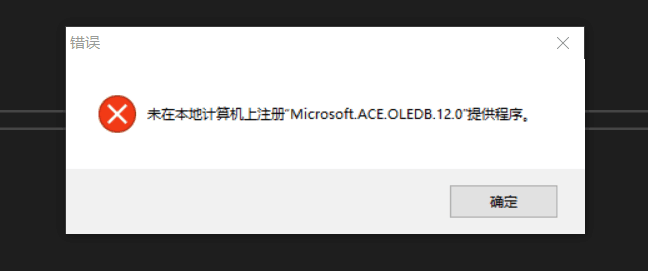 
>
> 可能是因为没有安装数据访问组件，需要安装相应版本的数据访问组件
> 
> 请在这里下载[Microsoft 2007 Office System 驱动程序](http://download.microsoft.com/download/7/0/3/703ffbcb-dc0c-4e19-b0da-1463960fdcdb/AccessDatabaseEngine.exe)

以下是程序运行效果图

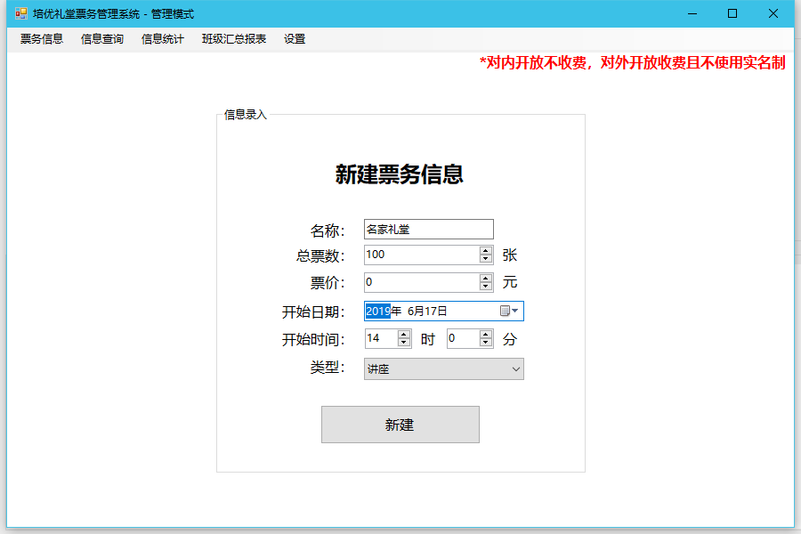
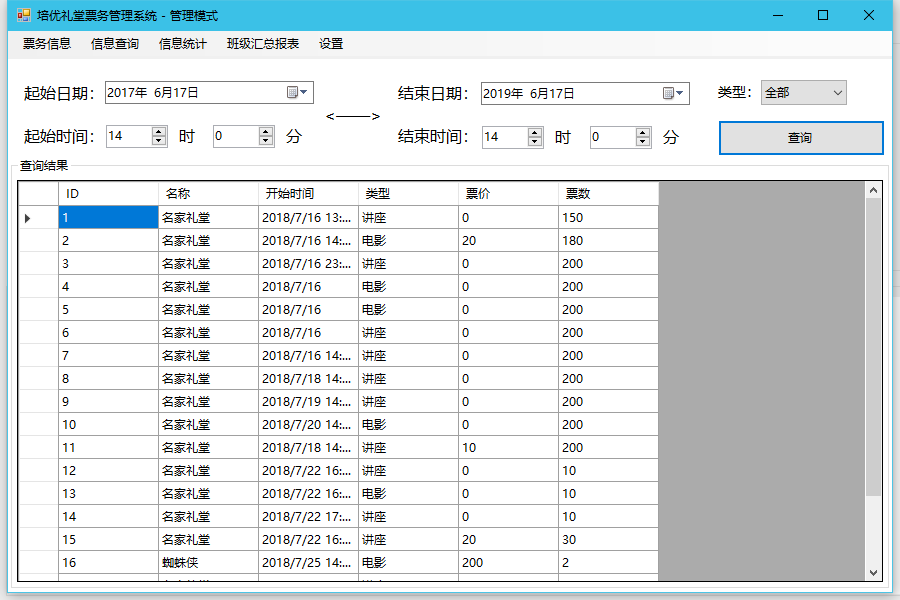
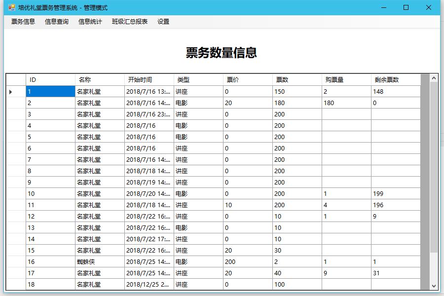
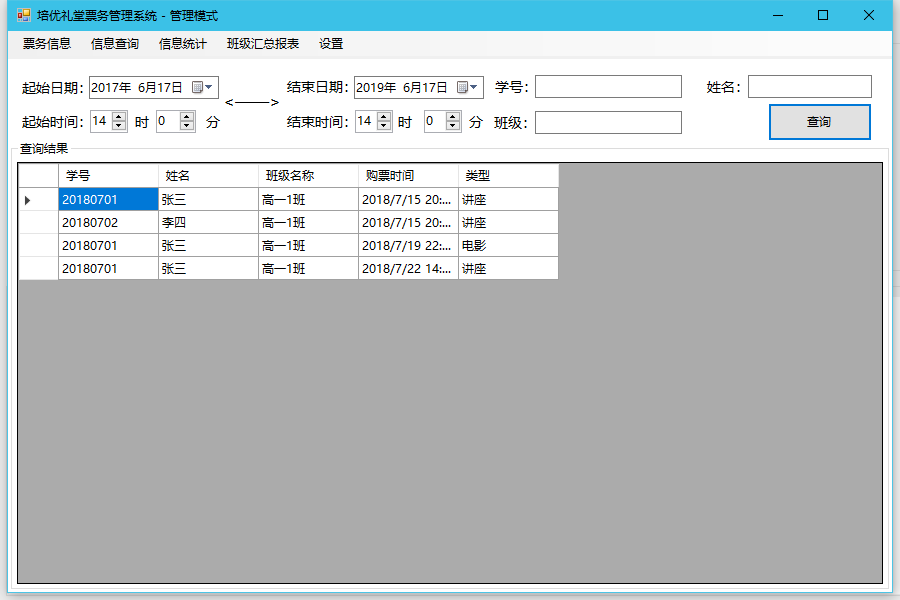
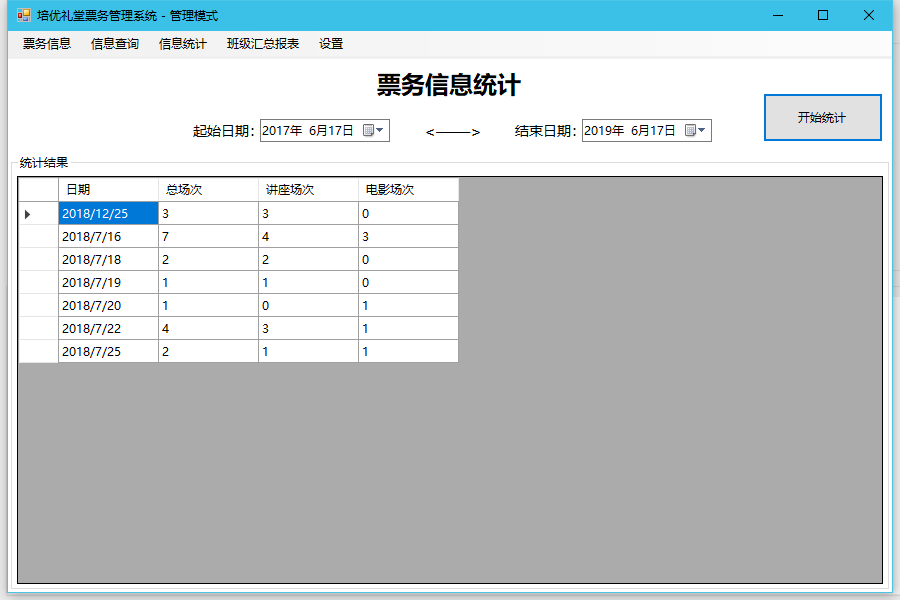
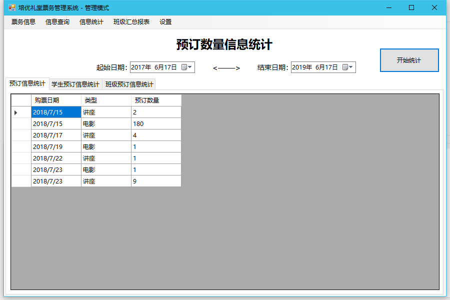
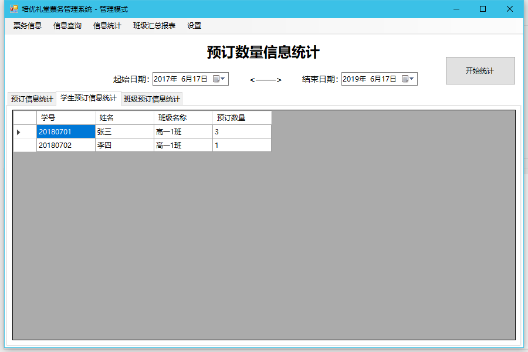
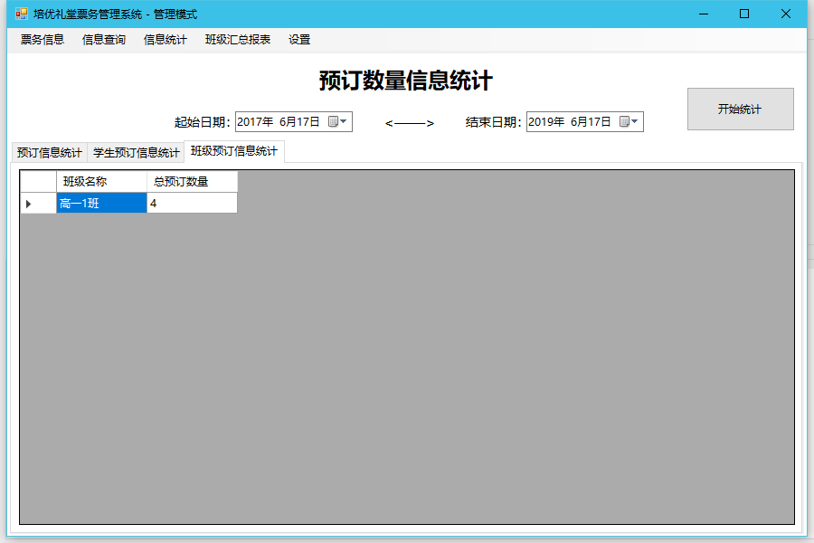
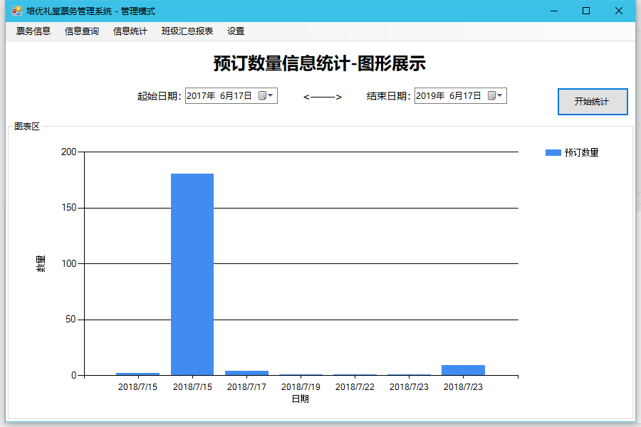
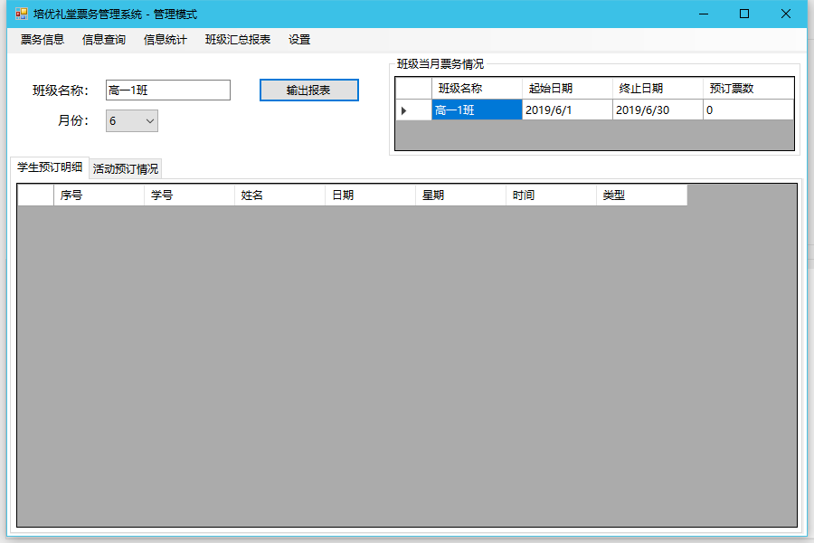
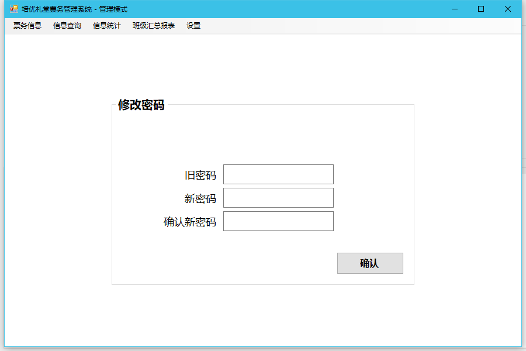